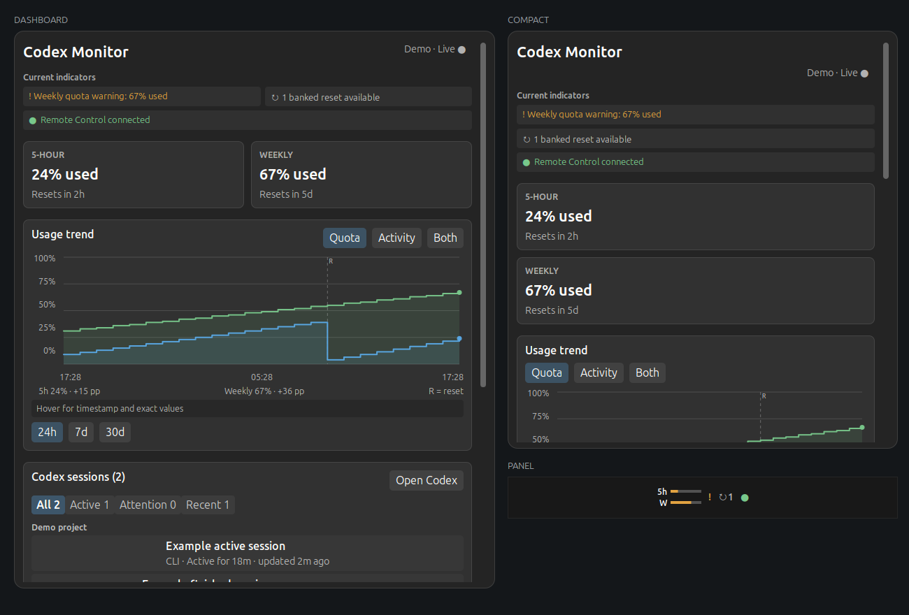

# Codex Monitor for Cinnamon

Keep an eye on Codex without keeping a terminal open. Codex Monitor adds a small usage meter to your Cinnamon panel and a detailed dashboard for quota, resets, sessions, Remote Control, and updates.



## What you can see

- **5-hour and weekly quota** in the panel, with exact percentages and reset countdowns in the dashboard
- **Clear status alerts** for quota warnings, expiring banked resets, stale data, and Remote Control
- **24-hour, 7-day, and 30-day history** for quota and token activity, including exact values under the pointer
- **Codex sessions** grouped by project, with current-turn elapsed time and Active, Attention, and Recent filters
- **Banked resets**, including expiry details and a confirmation before one is used
- **Remote Control** connection status, pairing, a live connected-device list, confirmed device removal, and safe recovery from a stuck Codex background service
- **Codex updates**, checked automatically and offered only when a newer stable version is available
- **Responsive dashboard layout** that keeps its full 640 px view on wide displays and stacks controls on narrow work areas

Missing information is shown as unavailable. The applet never guesses a quota, reset time, or connection state.

## Requirements

- Linux Mint or another Cinnamon desktop with Cinnamon 6.0–6.6; live tested on Cinnamon 6.6
- Python 3.10 or newer
- Codex CLI available as `codex`
- Optional: `python3-qrcode` for a scannable Remote Control pairing code; a manual code is always available

The applet does not install or change system packages.

## Install

### From a release

1. Download `codex-monitor@breixopd.zip` from the [latest release](https://github.com/breixopd/codex-monitor-cinnamon/releases/latest).
2. Extract it into `~/.local/share/cinnamon/applets/`.
3. Open **System Settings → Applets**, find **Codex Monitor**, and add it to a panel.

The final file should be at:

```text
~/.local/share/cinnamon/applets/codex-monitor@breixopd/metadata.json
```

### From the latest source

```sh
git clone https://github.com/breixopd/codex-monitor-cinnamon.git
cd codex-monitor-cinnamon
sh scripts/install.sh
```

Then add **Codex Monitor** from **System Settings → Applets**. The installer safely replaces an older copy and leaves only one version in Cinnamon's applet list.

If Cinnamon still shows an older copy, restart Cinnamon with <kbd>Alt</kbd>+<kbd>F2</kbd>, `r`, <kbd>Enter</kbd> on X11. On Wayland, log out and back in.

## Everyday use

The panel meter always shows the 5-hour and weekly windows. Status symbols appear only when there is something useful to report, such as a quota warning, an available reset, or an active Remote Control connection.

Click the applet to open the dashboard. From there you can:

- switch the graph between **Quota**, **Activity**, and **Both**
- choose a fixed **24h**, **7d**, or **30d** range
- open a Codex session in your default terminal
- start, pair, and manage Remote Control
- use a banked reset after confirming the action
- install a Codex update when one is available

The dashboard follows the work area of the display containing the applet. On narrow displays, quota cards, alerts, filters, Remote Control actions, and footer controls stack vertically; the same balanced margins and scrollbar gutter are preserved at every size.

Right-click the applet and choose **Configure** to change refresh frequency, history retention, graph defaults, warning thresholds, panel indicators, the Codex executable, or `CODEX_HOME`.

Remote Control is never started or repaired silently. Starting it, repairing a verified stale background service, stopping it, using a banked reset, installing an update, and removing a paired device all require confirmation.

The device section labels its own health as **Checking**, **Live**, **Unavailable**, or **Unsupported**. A temporary local connection failure keeps the last successful list visible and retries automatically; it is not treated as an empty list or blamed on an outdated Codex version.

## Privacy

Codex Monitor talks to the official local `codex app-server`. Quota and session requests use its standard input/output protocol; Remote device management uses Codex's user-owned Unix control socket. It does not read authentication files, copy API keys, scrape terminal output, or open a TCP network port.

Quota history is stored locally in:

```text
~/.local/share/codex-monitor@breixopd/history.jsonl
```

Pairing codes, account identity, session previews, device details, and updater output are kept only in memory while needed.

## Troubleshooting

**The applet is installed but not visible**

Open **System Settings → Applets** and add Codex Monitor to a panel. Installing it does not rearrange the panel automatically.

**Usage says “Not available”**

Make sure `codex` works in a terminal and is signed in. Some accounts or models do not report every quota window; the applet will leave those values unavailable.

**There is no QR code during pairing**

Install your distribution's `python3-qrcode` package, or use the manual pairing code shown in the same section.

**Paired devices says “Unavailable”**

The Codex Remote daemon is running, but its local device-management channel did not answer. The applet keeps the last successful list and retries automatically. Use **Refresh devices** after Codex Remote has reconnected; you do not need to stop Remote.

**Paired devices says “Unsupported”**

The installed Codex build does not expose the local device-management methods. Update Codex when the applet offers an update, then refresh the section.

**Starting Remote says the background service is stuck**

Choose **Repair Remote…** and confirm the repair. The applet proceeds only when it can prove that the recorded app-server is already dead and its parent is the matching user-owned Codex updater. It stops that stale updater with `SIGTERM`, bootstraps the official managed Remote service, and reconnects. Active terminal Codex sessions are not stopped. If any process detail is ambiguous or changes during validation, the repair refuses to run.

**Remove the applet completely**

Remove it from the panel in System Settings, then delete `~/.local/share/cinnamon/applets/codex-monitor@breixopd/`. Delete the history file above as well if you do not want to keep local graph history.

## License

MIT. See [LICENSE](LICENSE).
